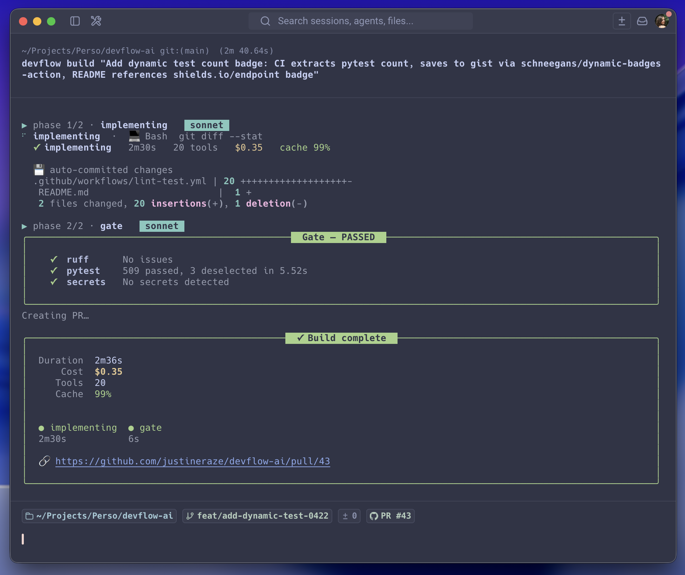
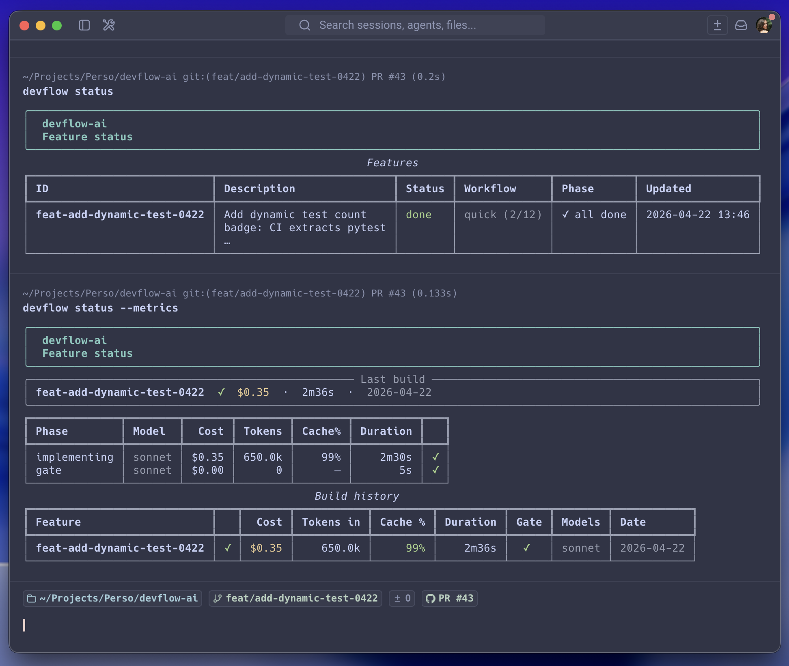

# devflow-ai

> State machine, quality gate, and cost tracking for Claude Code.

[](https://www.python.org)
[](LICENSE)
[](https://github.com/justineraze/devflow-ai/actions/workflows/lint-test.yml)
[](https://github.com/justineraze/devflow-ai/actions/workflows/lint-test.yml)

---

Claude Code is powerful but stateless. You re-explain context every session, manually run quality checks, and have no idea what anything costs. If the agent crashes mid-feature, you start over.

**devflow** wraps Claude Code with a persistent state machine, plan-first flow, automatic quality gate, cost tracking, and auto PR creation. You review the output — not manage the process.

---

## Build

One command: plan, implement, gate, PR.



Plan not right? Reject and resume with feedback:

```bash
devflow build "use a Rich panel instead of a table" --resume feat-001
```

---

## Track

Every build logs cost, model, cache rate, and phase timings.



---

## Install

Requires Python 3.11+, [Claude Code](https://docs.anthropic.com/en/docs/claude-code) (`claude`), and [GitHub CLI](https://cli.github.com/) (`gh`).

```bash
uv tool install devflow-ai
devflow install   # sync agents & skills to ~/.claude/
devflow doctor    # verify setup
```

---

## Commands

```
devflow build "description"                  Plan, implement, review, gate, PR
devflow build "feedback" --resume feat-001   Resume with feedback on the plan
devflow build "description" --base develop   Target a specific base branch
devflow fix "description"                    Quick fix (no planning phase)
devflow retry feat-001                       Retry from the last failed phase
devflow check                                Run quality gate locally
devflow status [feat-001]                    Show tracked features
devflow status --metrics                     Build cost and cache history
devflow log [feat-001]                       Phase history with timings
devflow sync                                 Post-merge cleanup
devflow install                              Install/update agents & skills
devflow init                                 Detect stack, initialize project
devflow doctor                               Check installation health
```

---

## License

MIT — see [LICENSE](LICENSE).
