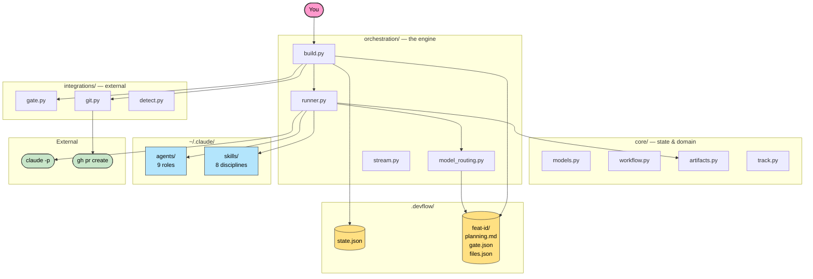

# devflow-ai

> State machine, quality gate, and cost tracking for Claude Code — so you ship features, not prompts.

[](https://www.python.org)
[](LICENSE)
[](tests/)
[](https://github.com/astral-sh/ruff)

---

## The problem

Claude Code is powerful but stateless. Every session starts from scratch — you re-explain context, manually run quality checks, copy-paste the PR description, and guess what it cost. There is no persistent state between sessions, no automated gate that blocks bad code, no automatic PR generation, and no cost tracking. If the agent breaks partway through, there is no recovery path.

You end up managing the process instead of reviewing the output.

---

## What devflow gives you

- **Persistent state** — features survive crashes, context switches, and new sessions. Resume exactly where you left off with `--resume`.
- **40–55% cost reduction** — artifact-based context sharing (each phase loads only the artifacts it needs) combined with automatic model routing (Haiku for trivial gate fixes, Sonnet/Opus where it matters).
- **Parallel quality gate** — ruff, pytest, and secrets scan run in parallel on every build. Gate failure triggers one targeted fix attempt before surfacing to you.
- **Auto-retry on gate failure** — structured `gate.json` (rule codes, tracebacks, secret matches) is injected into the fixing phase, not free-form text. Fixes are targeted, not guessed.
- **Plan-first flow** — you review and approve the plan before code is touched. Reject with feedback to steer the plan without losing context.
- **Automatic PR** — branch created, commits atomic, PR opened via `gh` with the plan as description.
- **260+ tests** — the engine is tested, not trusted.

---

## Demo

```
$ devflow build "Add caching layer"

────────────────────────────────────────────────────────────────────
Add caching layer
feat-add-caching-layer-0414  ·  🐍 python  ·  standard  ·  4 phases
🌿 feat/feat-add-caching-layer-0414
────────────────────────────────────────────────────────────────────

▶ phase 1/4 · planning    opus
  📖  Read      src/cache.py
  ⚡  Bash      git log --oneline -10
  ✓ planning   55s   2 tools   5 in (cache 51.5k) / 1.6k out   $0.25

╭─── Plan proposé ──────────────────────────────────────────────────╮
│ Scope: new-feature · medium · 3 files · 6 steps                   │
╰───────────────────────────────────────────────────────────────────╯
Lancer l'implémentation ? [Y/n] y

▶ phase 2/4 · implementing    sonnet
  📖  Read      src/cache.py
  📝  Edit      src/cache.py
  ⚡  Bash      pytest tests/test_cache.py
  ⚡  Bash      git commit -m "feat: add Cache class"
  ✓ implementing   2m34s   8 tools   5.2k in (cache 18k) / 1.8k out   $0.18

▶ phase 3/4 · reviewing    sonnet
  ⚡  Bash      git diff HEAD~1 -- src/cache.py
  ✓ reviewing   48s   1 tool   3.1k in (cache 22k) / 0.6k out   $0.21

▶ phase 4/4 · gate    sonnet
╭───────────────────────  Gate — PASSED  ───────────────────────────╮
│   ✓  ruff      No issues                                          │
│   ✓  pytest    174 passed                                         │
│   ✓  secrets   clean                                              │
╰───────────────────────────────────────────────────────────────────╯

╭─────────────────────  ✓ Build complete  ──────────────────────────╮
│  Duration  4m18s                                                  │
│      Cost  $0.64                                                  │
│     Tools  11                                                     │
│    Tokens  8.3k (cache 91.5k) in · 4.0k out                       │
│                                                                   │
│  Cost    █████░░░░░░░░░░░░░░░░░░░  $0.64 / $2.00   32%            │
│  Context ████████████░░░░░░░░░░░░  91.5k / 200.0k  46%            │
│                                                                   │
│  ● planning  ● implementing  ● reviewing  ● gate                  │
│  55s         2m34s           48s          1s                      │
│                                                                   │
│  🔗 https://github.com/you/repo/pull/42                           │
╰───────────────────────────────────────────────────────────────────╯
```

If the plan needs adjustment, refuse and resume with feedback:

```bash
devflow build "use Redis instead of in-memory" --resume feat-add-caching-layer-0413
```

---

## Architecture



Python handles what must be programmatic — state persistence, validated transitions, gate automation, cost tracking. Markdown handles what must be flexible — agent behavior, skill instructions, phase prompts. Neither leaks into the other.

---

## Under the hood

- **State machine with validated transitions** — `InvalidTransition` is raised on any illegal move. State persists to `.devflow/state.json` via atomic tmp + rename before every phase change. `FAILED` is recoverable; `DONE` is the only terminal state.
- **Prompt caching via `--system-prompt`** — agents and skills are passed as a stable system prompt, not injected into the user turn. Cache hit rate stays high across retries and resumes.
- **Artifact-based context sharing** — each phase declares its dependencies in `PHASE_CONTEXT_DEPS`. The runner loads exactly those artifacts (e.g. implementing gets `planning.md`; fixing gets `gate.json`). No full history concatenation, no stale context.
- **Artifact-aware model routing** — `model_routing.py` inspects `gate.json` and `files.json` before selecting a model tier. A fixing phase with only ruff errors routes to Haiku. A reviewing phase touching `auth/` or `crypto/` stays on Opus. Resolution order: YAML override → artifact selector → per-phase default.
- **Unified `PhaseSpec` registry** — all phases (name, model default, skills, artifact deps, prompt template) are declared once in `phases.py`. Workflows compose phases by name. No per-phase branching scattered across the codebase.

---

## Workflows

| Workflow | Phases | Use case |
|----------|--------|----------|
| `quick` | implement → gate | Bug fixes, small changes |
| `light` | plan → implement → gate | Known scope, low risk |
| `standard` | plan → implement → review → gate | Default for features |
| `full` | architect → plan → plan review → implement → review → fix → gate | Complex features |

```bash
devflow build "Add caching layer" --workflow full
devflow fix "Fix timezone bug"    # quick workflow
```

---

## Skills

8 skills injected into prompts based on the phase:

| Skill | Injected on | Purpose |
|-------|-------------|---------|
| `context-discipline` | every phase | Prevent over-exploration and token waste |
| `planning-rigor` | planning, architecture | Plans with named files, tests, risk assessment |
| `incremental-build` | implementing, fixing | Thin vertical slices, commit per step |
| `tdd-discipline` | implementing, fixing | Tests alongside code, not after |
| `refactor-first` | reviewing | Refactor dirty code instead of patching |
| `code-review` | reviewing, plan_review | 5-pass review |
| `build` | devflow phases | Build loop orchestration rules |
| `check` | gate | Quality gate checklist |

---

## Commands

| Command | Description |
|---------|-------------|
| `devflow doctor` | Check installation health |
| `devflow install` / `devflow update` | Sync agents and skills to `~/.claude/` |
| `devflow init` | Detect stack + initialize `.devflow/` |
| `devflow build "..."` | Build a feature (standard workflow by default) |
| `devflow build "..." --resume feat-001` | Resume with feedback on the plan |
| `devflow retry feat-001` | Retry the last failed phase |
| `devflow fix "..."` | Quick fix (no planning phase) |
| `devflow check` | Run quality gate (ruff + pytest + secrets) |
| `devflow sync [--dry-run] [--keep-artifacts]` | Post-merge cleanup: switch main, prune gone branches, archive done features |
| `devflow status [feat-001]` | Show tracked features or one feature detail |
| `devflow log [feat-001]` | Feature history with phase timings |

---

## Prerequisites

- Python 3.11+, [uv](https://docs.astral.sh/uv/)
- [Claude Code](https://docs.anthropic.com/en/docs/claude-code) — `claude` CLI
- [GitHub CLI](https://cli.github.com/) — `gh`

```bash
uv tool install devflow-ai
devflow install   # sync agents & skills to ~/.claude/
devflow doctor    # verify setup
```

---

## License

MIT — see [LICENSE](LICENSE).

Built by [Justine Raze](https://github.com/justineraze).
