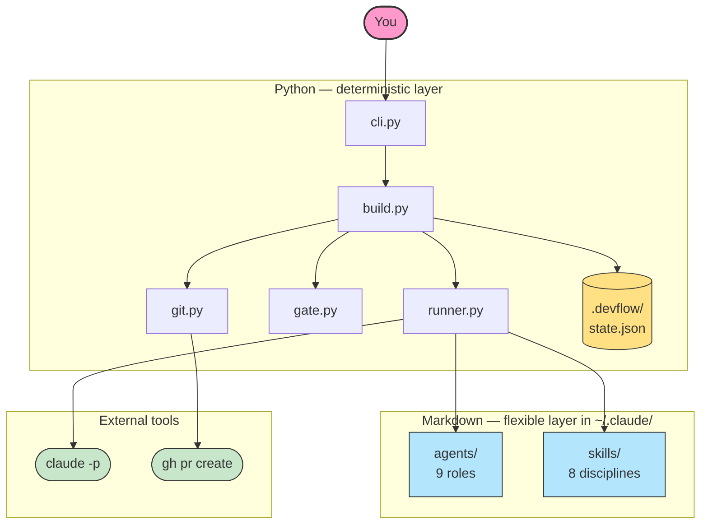
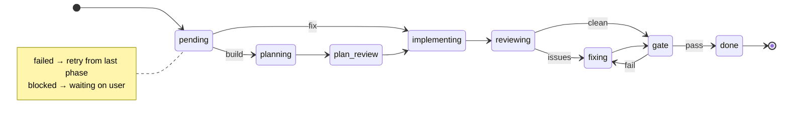

# devflow-ai

> CLI that installs and orchestrates an AI development environment for Claude Code.

[](LICENSE)
[](https://www.python.org)

devflow-ai doesn't reinvent Claude Code — it provides what Claude Code can't do natively: **persistent state**, **state machine**, **project tracking**, and **automated quality gates**.

---

## Prerequisites

- [Python 3.11+](https://www.python.org)
- [uv](https://docs.astral.sh/uv/) — Python package manager
- [Claude Code](https://docs.anthropic.com/en/docs/claude-code) — `claude` CLI
- [GitHub CLI](https://cli.github.com/) — `gh` (for PR creation)

```bash
devflow doctor                  # check your setup
```

## Quickstart

```bash
uv tool install devflow-ai      # install globally

devflow install                 # sync agents & skills to ~/.claude/
devflow init                    # detect stack + initialize project
devflow build "Add user auth"   # plan → review → implement → PR
devflow fix "Fix login bug"     # quick fix (no planning phase)
devflow check                   # run quality gate
devflow status                  # see what's in progress
```

---

## How a build looks

```
$ devflow build "Add caching layer"

devflow build — Add caching layer
feat-add-caching-layer-0413 | workflow: standard | 4 phases
branch: feat/feat-add-caching-layer-0413

Phase 1/4: planning... ✓ (1m12s)

╭─── Plan proposé ─────────────────────────────────────────╮
│ Plan: feat-add-caching-layer-0413                        │
│ Scope: new-feature, medium complexity                    │
│ Affected files: 3                                        │
│ Steps: 6                                                 │
│ ...                                                      │
╰──────────────────────────────────────────────────────────╯

Lancer l'implémentation ? [Y/n] y

Phase 2/4: implementing...
  📖 Read: models.py
  ✏️ Edit: cache.py
  ⚡ Bash: pytest tests/test_cache.py
  ⚡ Bash: git commit -m "feat: add Cache class"
  → 8 tools | 5.2k in / 1.8k out | 18¢
 ✓ (2m34s)

Phase 3/4: reviewing... ✓ (48s)
Phase 4/4: gate... ✓ (1s)
  ✓ ruff: No lint issues  ✓ pytest: 174 passed  ✓ secrets: clean

✓ Feature complete [4/4]
PR: https://github.com/you/repo/pull/42
```

The plan-first flow lets you review and approve before code is touched.
If the plan needs tweaks, refuse with `n` and resume with feedback:

```bash
devflow build "use Redis instead of in-memory" --resume feat-add-caching-layer-0413
```

Each phase shows live tool usage and token cost. Auto-commit after each
implementation slice. PR created automatically with the plan as description.

---

## Architecture



**The split:** Python handles what must be programmatic (state, validation, automation). Markdown handles what must be flexible (agent behavior, instructions, prompts).

---

## Workflows

Four built-in workflows, from fast to thorough:

| Workflow | Phases | Use case |
|----------|--------|----------|
| `quick` | implement → gate | Bug fixes, small changes |
| `light` | plan → implement → gate | Known scope, low risk |
| `standard` | plan → implement → review → gate | Default for features |
| `full` | architect → plan → plan review → implement → review → fix → gate | Complex features |

```bash
devflow build "Add caching layer" --workflow full
devflow fix "Fix timezone bug"    # uses quick automatically
```

### Model selection per phase

Each phase uses the right Claude tier automatically — Opus for deep reasoning,
Sonnet for execution. Typical savings: **3-5x cheaper** than running everything
on Opus.

| Phase | Model | Why |
|-------|-------|-----|
| `architecture`, `planning` | Opus | Structural decisions, multi-step plans |
| `reviewing` | Opus | Deep patch detection, security |
| `plan_review`, `implementing`, `fixing` | Sonnet | Execution, light checks |
| `gate` | (local) | No Claude involved — ruff/pytest/secrets |

---

## State machine

Every feature follows a lifecycle with validated transitions:



Invalid transitions raise `InvalidTransition`. State persists to `.devflow/state.json` before every phase change (crash-safe via tmp + rename).

---

## Agents

9 specialized agents installed to `~/.claude/agents/`:

| | Agent | Role |
|-|-------|------|
| **Planning** | `architect` | System design, module boundaries, dependency graphs |
| | `planner` | Step-by-step plans with risk assessment |
| **Implementation** | `developer` | Base rules: git workflow, architecture, error handling |
| | `developer-python` | Pydantic v2, typing, pytest, crash-safe I/O |
| | `developer-typescript` | Strict types, Zod, ESM, discriminated unions |
| | `developer-php` | PHP 8.2+, Laravel patterns, Pest, PHPStan |
| | `developer-frontend` | React/Next.js, CSS modules, a11y, performance |
| **Quality** | `reviewer` | 5-pass review: plan, correctness, security, quality, tests |
| | `tester` | Quality gate, coverage analysis, edge case audit |

Each agent has deep behavioral instructions with code examples, anti-patterns, output formats, and constraints. Not generic prompts — real engineering standards.

---

## Skills

8 skills injected into prompts based on the phase. Skills encode discipline
(how the agent should behave) separately from role (agent .md files).

| Skill | Injected on | Purpose |
|-------|-------------|---------|
| **context-discipline** | every phase | Strict rules to prevent over-exploration and token waste |
| **planning-rigor** | planning, architecture | Rigorous plans with named files, tests, quality audit |
| **refactor-first** | planning, implementing, reviewing | Refactor dirty code instead of shipping patches |
| **incremental-build** | implementing, fixing | Thin vertical slices, commit per step, verify-then-next |
| **tdd-discipline** | implementing, gate | Tests alongside code, not after |
| **code-review** | reviewing, plan_review | 5-pass review catching patches and quality issues |
| **build** | devflow-specific | How the build loop orchestrates phases |
| **check** | devflow-specific | Quality gate checklist |

---

## Commands

| Command | Description |
|---------|-------------|
| `devflow doctor` | Check installation health (Python, Claude, gh, agents) |
| `devflow version` | Show devflow version |
| `devflow install` / `devflow update` | Sync agents and skills to `~/.claude/` |
| `devflow init` | Detect stack + initialize `.devflow/` |
| `devflow build "..."` | Build a feature (default: standard workflow) |
| `devflow build "feedback" --resume feat-001` | Resume with feedback on the plan |
| `devflow retry feat-001` | Retry the last failed phase without feedback |
| `devflow fix "..."` | Fix a bug (quick workflow) |
| `devflow check` | Run quality gate (ruff + pytest + secrets) |
| `devflow status` | Show all tracked features |
| `devflow status feat-001` | Show details for one feature |
| `devflow log` | Show feature history (status, duration, date) |
| `devflow log feat-001` | Detailed log for one feature with phase timings |

---

## Contributing

See [CONTRIBUTING.md](CONTRIBUTING.md).

## License

MIT — see [LICENSE](LICENSE).
