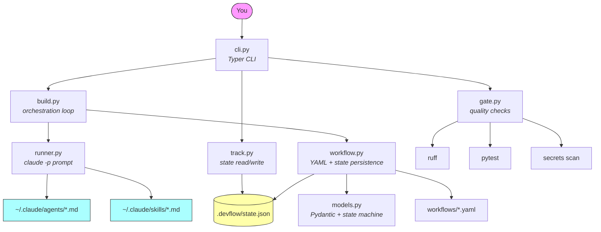
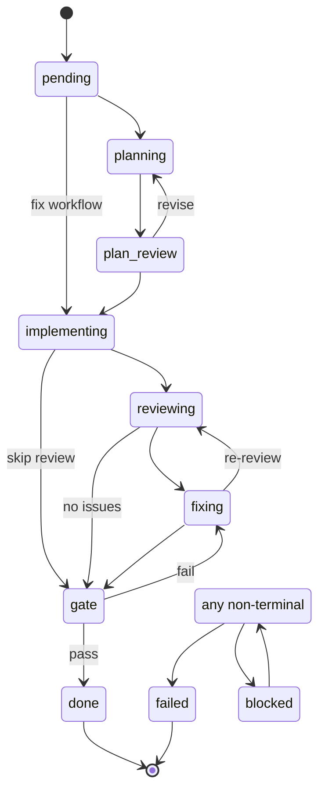

# devflow-ai

> CLI that installs and orchestrates an AI development environment for Claude Code.

[](LICENSE)
[](https://www.python.org)

devflow-ai doesn't reinvent Claude Code — it provides what Claude Code can't do natively: **persistent state**, **state machine**, **project tracking**, and **automated quality gates**.

---

## Prerequisites

- [Python 3.11+](https://www.python.org)
- [uv](https://docs.astral.sh/uv/) — Python package manager
- [Claude Code](https://docs.anthropic.com/en/docs/claude-code) — `claude` CLI
- [GitHub CLI](https://cli.github.com/) — `gh` (for PR creation)

```bash
devflow doctor                  # check your setup
```

## Quickstart

```bash
uv tool install devflow-ai      # install globally

devflow install                 # sync agents & skills to ~/.claude/
devflow init                    # detect stack + initialize project
devflow build "Add user auth"   # plan → review → implement → PR
devflow fix "Fix login bug"     # quick fix (no planning phase)
devflow check                   # run quality gate
devflow status                  # see what's in progress
```

---

## Architecture



**The split:** Python handles what must be programmatic (state, validation, automation). Markdown handles what must be flexible (agent behavior, instructions, prompts).

---

## Workflows

Four built-in workflows, from fast to thorough:

| Workflow | Phases | Use case |
|----------|--------|----------|
| `quick` | implement → gate | Bug fixes, small changes |
| `light` | plan → implement → gate | Known scope, low risk |
| `standard` | plan → implement → review → gate | Default for features |
| `full` | architect → plan → plan review → implement → review → fix → gate | Complex features |

```bash
devflow build "Add caching layer" --workflow full
devflow fix "Fix timezone bug"    # uses quick automatically
```

---

## State machine

Every feature follows a lifecycle with validated transitions:



Invalid transitions raise `InvalidTransition`. State persists to `.devflow/state.json` before every phase change (crash-safe via tmp + rename).

---

## Agents

9 specialized agents installed to `~/.claude/agents/`:

| | Agent | Role |
|-|-------|------|
| **Planning** | `architect` | System design, module boundaries, dependency graphs |
| | `planner` | Step-by-step plans with risk assessment |
| **Implementation** | `developer` | Base rules: git workflow, architecture, error handling |
| | `developer-python` | Pydantic v2, typing, pytest, crash-safe I/O |
| | `developer-typescript` | Strict types, Zod, ESM, discriminated unions |
| | `developer-php` | PHP 8.2+, Laravel patterns, Pest, PHPStan |
| | `developer-frontend` | React/Next.js, CSS modules, a11y, performance |
| **Quality** | `reviewer` | 5-pass review: plan, correctness, security, quality, tests |
| | `tester` | Quality gate, coverage analysis, edge case audit |

Each agent has deep behavioral instructions with code examples, anti-patterns, output formats, and constraints. Not generic prompts — real engineering standards.

---

## Skills

| Skill | Purpose |
|-------|---------|
| **build** | Orchestrates the feature build loop through the state machine |
| **check** | Quality gate checklist (automated + behavioral) |
| **gsd** | Fresh context per phase, atomic commits, verify-after-change |
| **rtk** | Token compression: targeted reads, filtered output, skip known-good |

---

## Commands

| Command | Description |
|---------|-------------|
| `devflow doctor` | Check installation health (Python, Claude, gh, agents) |
| `devflow install` | Sync agents and skills to `~/.claude/` |
| `devflow update` | Update agents and skills to latest |
| `devflow init` | Detect stack + initialize `.devflow/` |
| `devflow build "..."` | Build a feature (default: standard workflow) |
| `devflow build "feedback" --resume feat-001` | Resume with feedback on the plan |
| `devflow fix "..."` | Fix a bug (quick workflow) |
| `devflow check` | Run quality gate (ruff + pytest + secrets) |
| `devflow status` | Show all tracked features |
| `devflow status feat-001` | Show details for one feature |

---

## Contributing

See [CONTRIBUTING.md](CONTRIBUTING.md).

## License

MIT — see [LICENSE](LICENSE).
